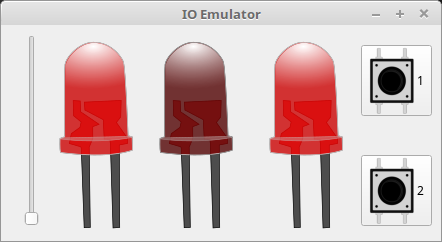

# ioemu



The ioemu-project provides an  emulator for input/output operations with simple electronic components like LEDs and push buttons.

## Installation and Upgrade

Use pip for a simple installation. For an update use `install --update`. 

- Linux, MacOS: `python3 -m pip install ioemu`
- Windows: `python -m pip install ioemu`

## Starting the emulator

First start the emulator by entering `ioemu` on the commandline. A Gui will show up.


It contains a slider for analog values between 0 and 99, threee LEDs and two push buttons from left to right.

## LEDs

If the emulator is running, you can interact with it from any python program running on the same machine. First import the class `Emulator` from the `ioemu` package.


```python
from ioemu import Emulator
```

Now create an instance of the emulator and switch some LEDs on. They can be controlled by setting the `leds` attribute.


```python
emu = Emulator()
emu.leds = [True, False, True]
```

## Buttons


The emulator has two buttons. Their current state (pressed or not pressed) can be read from the attribute `buttons`. It's a bool array corresponding to the state of being pressed.

The following program lights up some LEDs depending on the button being pressed.


```python
emu = Emulator()
while True:
    if emu.buttons[0]:
        emu.leds = [False, True, True]
        
    if emu.buttons[1]:
        emu.leds = [True, True, False]

    if not (emu.buttons[0] or emu.buttons[1]):
        emu.leds = [False, False, False]
```

## Analog Value (0-99)

Let's look into a program that allows you to control the LEDs with the slider at the left. The current sliders value can be read from the `analog_value` attribute of the Emulator. Its value ranges from 0 to 99.


```python
import time

emu = Emulator()
led_on = 0

while True:
    if 0 <= emu.analog_value < 25:
        emu.leds = [False, False, False]
    elif 25 <= emu.analog_value < 50:
        emu.leds = [True, False, False]
    elif 50 <= emu.analog_value < 75:
        emu.leds = [True, True, False]
    else:
        emu.leds = [True, True, True]
```

## Demo

There is a demo program that can be started with `python -m ioemu.demo`. It will blink the LEDs and print the current button state as well as the analog value to console.


You can find the source code in [demo.py](ioemu/demo.py).

## Bugs

If you find any bugs or have a feature request, feel free to file a ticket at the projects [bugtracker](https://github.com/tbs1-bo/ioemu/issues/new) at github.
